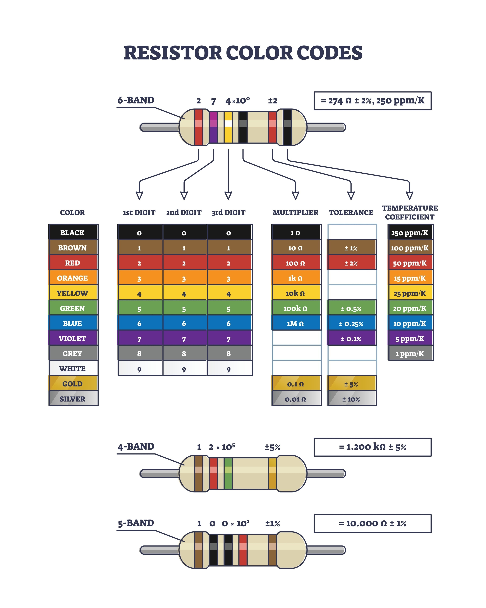

⚡ Calculadora de Consumo de EnergiaUma ferramenta interativa desenvolvida em JavaScript para calcular o consumo mensal de eletrodomésticos e o impacto financeiro na conta de luz.

🎯 Sobre o ProjetoO objetivo deste script é automatizar o cálculo de gasto energético de aparelhos domésticos. Ele permite que o usuário insira a potência conforme consta no manual ou etiqueta do produto (seja em Watts ou kW) e receba o valor projetado para o mês.

✨ FuncionalidadesIdentificação do Aparelho: Entrada personalizada com o nome do eletrodoméstico.Conversão Automática: Suporte para potências em Watts (W) com conversão interna para kWh.Cálculo de Ciclo Mensal: Projeção baseada em um uso contínuo por 30 dias.Estimativa de Custo: Cálculo do valor em Reais (R$) baseado na tarifa local.

📐 Lógica de CálculoO sistema processa as informações utilizando as seguintes bases matemáticas:Potência em Watts: O valor é dividido por $1000$ para converter em Kilowatts.Consumo Mensal:$$Consumo (kWh) = Potência (kW) \times Horas\ de\ Uso \times 30\ dias$$Custo Mensal:$$Valor (R\$) = Consumo (kWh) \times Tarifa\ (R\$)$$

🛠️ TecnologiasLinguagem: JavaScript (ES6+)Interface: Browser (Diálogos nativos prompt e alert)Nota: A tarifa base utilizada no script é de R$ 0,90 por kWh, mas este valor pode ser alterado diretamente no código para refletir a tarifa da sua região.

----------------------------------------------------------------------------------------------------------------------------------

📏 Conversor de Escalas MétricasEste projeto é um script em JavaScript desenvolvido para realizar a conversão entre diferentes ordens de magnitude do Sistema Internacional de Unidades (SI). Ele permite transformar valores numéricos entre prefixos que variam do Giga ($10^9$) até o Nano ($10^{-9}$).

💡 O ConceitoA conversão de unidades baseia-se na relação entre potências de 10. O script automatiza o cálculo matemático necessário para deslocar a casa decimal de acordo com a unidade de origem e a unidade de destino escolhida pelo usuário.Escalas Suportadas:Grandes Magnitudes: Giga (G), Mega (M) e Kilo (k).Unidade Base: O valor central (1).Pequenas Magnitudes: Milli (m), Micro (µ) e Nano (n).

⚙️ FuncionamentoO programa interage com o usuário em três etapas simples:Entrada de Dados: Solicita o valor numérico que será convertido.Identificação da Origem: O usuário escolhe em qual unidade o valor atual se encontra.Definição do Destino: O usuário escolhe para qual unidade deseja transformar esse valor.A lógica utiliza a divisão entre a potência da unidade atual e a potência da unidade de destino para encontrar o fator multiplicador exato, garantindo precisão no resultado final exibido na tela.

🛠️ Tecnologias e RequisitosEste é um projeto de lógica pura, utilizando JavaScript (ES6). Para executá-lo, basta um navegador web moderno (Chrome, Firefox, Edge, etc).O script faz uso de recursos nativos como:Arrays: Para armazenar os valores das potências.Operadores Aritméticos: Para o cálculo de conversão.Janelas de Diálogo: prompt() para capturar dados e alert() para exibir o resultado.

🚀 Como ExecutarPara testar o conversor, você pode copiar o código e colá-lo diretamente no Console do Desenvolvedor do seu navegador (pressione F12 e vá na aba "Console") ou vinculá-lo a um arquivo HTML simples.Nota: Este projeto foi criado com fins didáticos para demonstrar a manipulação de constantes matemáticas e interação básica com o usuário em ambiente web.

----------------------------------------------------------------------------------------------------------------------------------

Calculadora de Resistores em JavaScript
Sobre o Projeto
Este projeto consiste em uma ferramenta interativa desenvolvida para facilitar a identificação e o cálculo do valor de resistência (em Ohms) de resistores de 4 e 5 faixas.

A lógica foi construída para converter as cores padronizadas internacionalmente em valores numéricos precisos, incluindo o multiplicador e a margem de tolerância.

[alt text](image.png)

Funcionalidades
O script opera através de diálogos de entrada no navegador e oferece suporte para:

Cálculo de 4 Faixas: Processa os dois primeiros dígitos significativos, o multiplicador e a tolerância.

Cálculo de 5 Faixas: Ideal para resistores de precisão, processando três dígitos significativos antes da multiplicação.

Conversão Automática: Transforma a seleção de cores em potências de base 10 para determinar o valor final.

Como Funciona a Lógica
O sistema utiliza um mapeamento numérico onde cada cor corresponde a um valor específico:

Dígitos Significativos: O usuário informa os índices das cores (de 0 a 9) para formar a base do número.

Multiplicador: Define a magnitude do resistor, elevando a base à potência correspondente.

Tolerância: Identifica a variação permitida no valor real do componente (Dourado ou Prata).

Como Utilizar
Para rodar a aplicação, basta abrir o console do navegador (F12) em qualquer página ou vincular o script a um arquivo HTML simples.

Informe se o resistor possui 4 ou 5 faixas.

Siga as instruções na tela inserindo o número correspondente à cor de cada faixa.

O resultado será exibido instantaneamente em um alerta na tela, mostrando o valor total em Ohms e a porcentagem de tolerância.